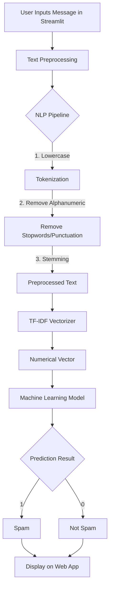

# 📧 Email/SMS Spam Classifier

An interactive web application built with Streamlit that classifies Email and SMS messages into **Spam** or **Not Spam** (Ham) using a Machine Learning model. The project leverages Natural Language Processing (NLP) techniques with the NLTK library to preprocess text and a trained Scikit-Learn model to predict the outcome.

## 🚀 Features
- **Real-time Classification:** Input any message and instantly classify it as Spam or Not Spam.
- **NLP Text Preprocessing:** Includes tokenization, removing stop words, punctuation, and stemming using `PorterStemmer` from NLTK.
- **TF-IDF Vectorization:** Converts preprocessed text into meaningful numerical vectors.
- **Interactive Web Interface:** User-friendly UI created with Streamlit.
- **Ready for Deployment:** Contains `Procfile` and `setup.sh` tailored for Heroku/Cloud deployment.

## 📊 Flowchart

The following diagram illustrates the internal workflow of the message classification process:



## 📂 Project Structure
```text
📦 spam-classifier-main
 ┣ 📂 spam-classifier
 ┃ ┣ 📜 app.py                     # Main Streamlit application file
 ┃ ┣ 📜 model.pkl                  # Pre-trained Machine Learning model
 ┃ ┣ 📜 vectorizer.pkl             # Pre-trained TF-IDF vectorizer
 ┃ ┣ 📜 sms-spam-detection.ipynb   # Jupyter Notebook used for model training and EDA
 ┃ ┣ 📜 spam.csv                   # Dataset used for training
 ┃ ┣ 📜 requirements.txt           # Python dependencies needed
 ┃ ┣ 📜 setup.sh                   # Shell script to configure Streamlit properties
 ┃ ┣ 📜 Procfile                   # Configuration for cloud deployment 
 ┃ ┗ 📜 nltk.txt                   # NLTK requirements for deployments
 ┣ 📜 README.md                    # Detailed documentation of the project
 ┗ 📜 LICENSE                      # License details for the project
```

## 🛠️ Tech Stack
- **Language:** Python
- **Libraries/Frameworks:**
  - `Streamlit` (Web App Framework)
  - `NLTK` (Natural Language Toolkit)
  - `Scikit-Learn` (Machine Learning & Vectorization)
  - `Pickle` (Model Serialization)

## 💻 Installation and Setup

### Prerequisites
Make sure you have Python 3.8+ installed on your local machine.

### 1. Clone the repository
```bash
git clone https://github.com/your-username/spam-classifier-main.git
cd spam-classifier-main/spam-classifier
```

### 2. Install dependencies
Install all required Python libraries by running:
```bash
pip install -r requirements.txt
```
*Note: You may also need to download necessary NLTK corpora. This app expects standard NLTK tokenizers and stopwords.*

### 3. Run the application
To start the Streamlit server locally, use the following command:
```bash
streamlit run app.py
```
After executing the command, point your web browser to `http://localhost:8501`.

## 🤝 Contributing
Contributions are highly welcome! To contribute to this project, please follow these steps:

1. **Fork the repository** to your own GitHub account.
2. **Clone the repository** locally.
3. **Create a new branch** for your feature or bug fix:
   ```bash
   git checkout -b feature/your-feature-name
   ```
4. **Make your changes** and commit them with descriptive messages:
   ```bash
   git commit -m "Add some feature"
   ```
5. **Push to the branch**:
   ```bash
   git push origin feature/your-feature-name
   ```
6. **Open a Pull Request** against the main branch of the original repository.

Please ensure your code follows the existing style, and consider updating documentation/README if your change introduces new functionality or logic.

## 📜 License
This project is licensed under the MIT License. See the [LICENSE](LICENSE) file for more information.

---
*Created carefully by the open-source community. If you found this useful, don't forget to ⭐ star the repository!*
